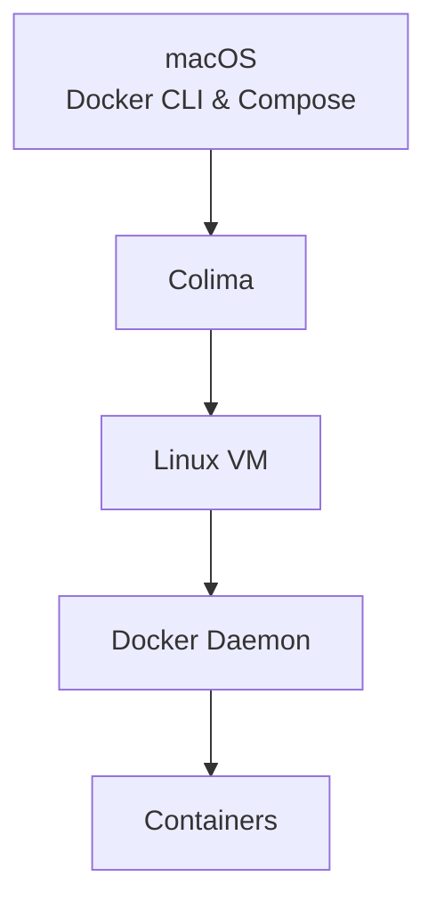

# Prelude

Containers have become a foundational technology in modern software development due to their portability, efficiency, and consistency across environments. Tools like Docker have made it easy for developers to package applications and their dependencies into containers that can run almost anywhere.

However, macOS users often encounter an important question early on: **why do we need tools like Colima to run Docker on macOS at all?** After all, Docker commands run just fine in the terminal.

This post explains the underlying technical reasons, defines the key concepts involved, and shows how Colima enables containers to run seamlessly on macOS.

# Containers and the Linux Kernel

To understand the problem, we must first understand **what containers are**.

Containers are **not virtual machines**. Instead, they rely on features provided by the **Linux kernel**, such as:
- Namespaces (process isolation)
- Control groups (resource limits)
- Union filesystems (layered images)

Because of this, **containers can only run on a Linux kernel**.

This is a crucial point:  
> Containers are a Linux kernel feature, not just a Docker feature.

# What Is a Kernel?

A **kernel** is the core part of an operating system. It:
- Manages CPU, memory, and devices
- Schedules processes
- Provides system calls for applications

Linux has the **Linux kernel**, which includes the container-related features mentioned above.

macOS, however, uses a different kernel called **XNU**. While XNU is a powerful kernel, it does **not** implement Linux container primitives.

As a result:
- macOS **cannot run Linux containers directly**
- A Linux kernel must exist *somewhere* for containers to work

# Docker: CLI vs Daemon

Docker is often thought of as a single tool, but it is actually composed of multiple parts.

## Docker CLI
- Runs natively on macOS
- Accepts user commands like `docker run` and `docker build`
- Does **not** run containers itself

## Docker Daemon
- A background process (daemon)
- Responsible for:
  - Building images
  - Creating and running containers
  - Managing networks and volumes
- **Must run on a Linux system**

The Docker CLI simply sends instructions to the Docker daemon. Without a running daemon, containers cannot be created.

# What Is a Daemon?

A **daemon** is a background process that runs continuously and waits for requests.

Examples include:
- Web servers
- SSH servers
- The Docker daemon (`dockerd`)

In the Docker architecture:
- The CLI sends requests
- The daemon performs the actual work

# The macOS Problem

At this point, the limitation becomes clear:

- Containers need a **Linux kernel**
- The Docker daemon needs to run on **Linux**
- macOS does **not** have a Linux kernel

So while macOS can run:
- Docker CLI
- Docker Compose (a tool for defining multi-container applications)

It cannot run:
- The Docker daemon
- Linux containers directly

# How Colima Solves the Problem

Colima bridges this gap.

## What Is Colima?

Colima is a tool that:
- Creates a **lightweight Linux virtual machine** on macOS
- Runs the Docker daemon inside that VM
- Exposes the daemon to the Docker CLI on macOS

The VM includes:
- A Linux kernel
- Container runtime support
- Docker Engine (daemon)

# How Everything Works Together

The full flow looks like this:

1. You run `docker` or `docker compose` on macOS
2. The Docker CLI sends instructions
3. Those instructions are forwarded to the Docker daemon
4. The daemon runs **inside Colima’s Linux VM**
5. Containers are created and managed using the Linux kernel in the VM

From the user’s perspective, this feels like Docker is running locally, even though the actual container execution happens inside the VM.

# Why Not Just Install Docker Directly?

Docker Desktop also solves this problem by running a Linux VM, but it:
- Is heavier
- Includes additional proprietary components
- Requires a commercial license for some use cases

Colima is often preferred because it is:
- Lightweight
- Open-source
- Focused purely on container runtime needs

# Funfacts
When installing docker compose, the command

```bash
brew install docker-compose
```
is issued. However, since it is a plugin for Docker, it works as a subcommand for Docker. So it is 
used as docker subcommand `compose`.

```bash
docker compose version
```


# Summary

- Containers require Linux kernel features
- macOS does not have a Linux kernel
- Docker CLI can run on macOS, but the Docker daemon cannot
- Colima provides a lightweight Linux VM
- The Docker daemon runs inside that VM
- Docker CLI and Docker Compose on macOS communicate with the daemon to run containers

This layered approach allows macOS users to work with containers efficiently while respecting the fundamental Linux dependency of container technology.
